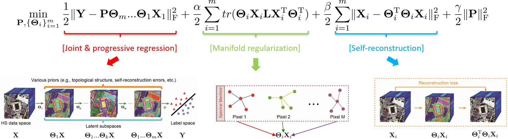

# Joint & Progressive Learning from High-Dimensional Data for Multi-Label Classification

Danfeng Hong, Naoto Yokoya, Jian Xu, Xiaoxiang Zhu
---------------------

The code in this toolbox implements the ["Joint & Progressive Learning from High-Dimensional Data for Multi-Label Classification"](https://eccv2018.org/openaccess/content_ECCV_2018/papers/Danfeng_Hong_Joint__Progressive_ECCV_2018_paper.pdf).
More specifically, it is detailed as follow.

Citation
---------------------

**Please kindly cite the papers if this code is useful and helpful for your research.**

     @inproceedings{hong2018joint,
      title     = {Joint & progressive learning from high-dimensional data for multi-label classification},
      author    = {Hong, Danfeng and Yokoya, Naoto and Xu, Jian and Zhu, Xiao Xiang},
      booktitle = {Proceedings of the European Conference on Computer Vision (ECCV)},
      pages     = {469--484},
      year      = {2018}
     }
     
     @inproceedings{hong2020joint,
      title     = {Joint and Progressive Subspace Analysis (JPSA) with Spatial-Spectral Manifold Alignment for Semi-Supervised Hyperspectral Dimensionality Reduction},
      author    = {Hong, Danfeng and Yokoya, Naoto and Chanussot, Jocelyn and Xu, Jian and Zhu, Xiao Xiang},
      booktitle = {IEEE Trans. Cybern.},
      year      = {2020}
     }

System-specific notes
---------------------
The code was tested in Matlab R2016a or higher versions on Windows 10 machines.

How to use it?
---------------------

Directly run demo_hyperspectral.m or demo_general.m on the data used in the aforementioned paper.

If you want to run the code in your own data, you can simply change the input and accordingly tune the parameters.

If you want to run the code in your own data, you can accordingly change the input (e.g., data, labels) and tune the parameters.

If you encounter the bugs while using this code, please do not hesitate to contact us.

Acknowledgment
---------------------

We would like to thank Prof. Deng Cai, Dr. Tom Rainforth, and Prof. Chih-Chung Chang and Prof. Chih-Jen Lin for providing the Matlab Codes of LPP, CCF, and SVM, respectively. 
Codes for these algorithms used in our paper can be found in the following.

LPP: the code is available in http://www.cad.zju.edu.cn/home/dengcai/.

CCF: the code is available in https://github.com/jandob/ccf.

SVM: the code is available in https://www.csie.ntu.edu.tw/~cjlin/libsvm/oldfiles/index-1.0.html.

If you want to use the codes mentioned above, please cite the corresponding articles as well.

References:  
[1] He, Xiaofei, and Partha Niyogi. "Locality preserving projections." Advances in neural information processing systems. 2004.  
[2] Cai, Deng, Xiaofei He, and Jiawei Han. "Document clustering using locality preserving indexing." IEEE Transactions on Knowledge and Data Engineering 17.12 (2005): 1624-1637.  
[3] Rainforth, Tom, and Frank Wood. "Canonical correlation forests." arXiv preprint arXiv:1507.05444 (2015).  
[4] Chang, Chih-Chung, and Chih-Jen Lin. "LIBSVM: a library for support vector machines." ACM transactions on intelligent systems and technology (TIST) 2.3 (2011): 27.

For the datasets, you can

   apply for the Univeristy of Houston hyperspectral dataset from http://www.grss-ieee.org/community/technical-committees/data-fusion/2013-ieee-grss-data-fusion-contest/.  

   download the Indine Pine hyperspectral dataset from https://engineering.purdue.edu/~biehl/MultiSpec/hyperspectral.html.  

   download the Extended Yale-B face dataset from http://vision.ucsd.edu/~leekc/ExtYaleDatabase/ExtYaleB.html.  
    
   download the AR face dataset from http://www2.ece.ohio-state.edu/~aleix/ARdatabase.html.  

References:  
[1] Baumgardner, Marion F., Larry L. Biehl, and David A. Landgrebe. "220 band aviris hyperspectral image data set: June 12, 1992 indian pine test site 3." Purdue University Research Repository (2015): R7RX991C.  
[2] Lee, Kuang-Chih, Jeffrey Ho, and David J. Kriegman. "Acquiring linear subspaces for face recognition under variable lighting." IEEE Transactions on Pattern Analysis & Machine Intelligence 5 (2005): 684-698.  
[3] Martinez, Aleix M. "The AR face database." CVC Technical Report24 (1998).

Licensing
---------

Copyright (C) 2018 Danfeng Hong

This program is free software: you can redistribute it and/or modify it under the terms of the GNU General Public License as published by the Free Software Foundation, version 3 of the License.

This program is distributed in the hope that it will be useful, but WITHOUT ANY WARRANTY; without even the implied warranty of MERCHANTABILITY or FITNESS FOR A PARTICULAR PURPOSE. See the GNU General Public License for more details.

You should have received a copy of the GNU General Public License along with this program.

Contact Information:
--------------------

Danfeng Hong: hongdanfeng1989@gmail.com 
Danfeng Hong is with the Remote Sensing Technology Institute (IMF), German Aerospace Center (DLR), Germany;  
&nbsp; &nbsp; &nbsp; &nbsp; &nbsp; &nbsp; &nbsp; &nbsp; &nbsp; &nbsp; &nbsp; &nbsp; &nbsp; &nbsp; with the Singnal Processing in Earth Oberservation (SiPEO), Technical University of Munich (TUM), Germany. 
